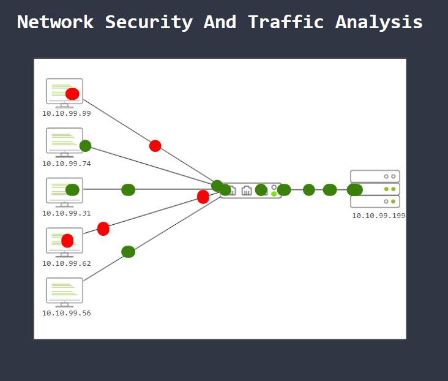

Network Security

Network security is mainly focused on two core ideas: authentication and authorisation. In simple terms, it ensures that only legitimate users and devices can access network resources, and only with the permissions they are supposed to have.

To achieve this, network security relies on three main control levels:

Physical controls protect the hardware itself, such as networking devices, cables, racks, and other physical components, from unauthorised access.

Technical controls protect the data moving across the network, for example by using encryption, tunnels, and additional security layers.

Administrative controls provide consistency through policies, access rules, and authentication procedures.

Network security can also be divided into two main approaches: Access Control and Threat Control.

Access Control

Access control is the starting point of network security. Its purpose is to verify identities and decide what level of access a user or device should have.

Some of the most common access control elements are:

Firewall Protection, which filters inbound and outbound traffic according to predefined security rules.

Network Access Control (NAC), which checks whether a device is compliant before allowing it onto the network.

Identity and Access Management (IAM), which manages user identities and permissions.

Load Balancing, which distributes traffic and workloads across resources to improve performance and availability.

Network Segmentation, which divides the network into separate zones to reduce exposure and protect sensitive systems.

Virtual Private Networks (VPNs), which create encrypted communication channels, especially for remote access.

Zero Trust, which follows the principle of never trust, always verify, granting only the minimum access required.

Threat Control

Threat control focuses on detecting and stopping malicious or abnormal activity on the network.

Important threat control technologies include:

IDS/IPS, which inspect traffic and either generate alerts or actively block suspicious activity.

Data Loss Prevention (DLP), which helps prevent the unauthorised transfer of sensitive data.

Endpoint Protection, which secures devices connected to the network using multiple layers such as antivirus, encryption, and monitoring.

Cloud Security, which protects cloud-based services and resources from attacks and data leaks.

SIEM, which centralises logs and events to support threat detection and incident management.

SOAR, which automates and coordinates actions between security tools and analysts.

Network Traffic Analysis / NDR, which inspects traffic patterns to detect anomalies and threats.

Network Security Operations

A typical network security operation includes several phases:

Deployment, where devices and software are installed.

Configuration, where access settings, automation, NAT, VPNs, and security policies are defined.

Management, where threats are mitigated and systems are administered.

Monitoring, where user activity, threats, logs, and traffic are observed.

Maintenance, which includes updates, upgrades, rule tuning, and licence management.

Managed Security Services

Not every organisation has the budget or internal staff to manage all of these tasks on its own. For this reason, many organisations rely on Managed Security Services (MSS), provided by external Managed Security Service Providers (MSSPs).

These services may include:

Network Penetration Testing

Vulnerability Assessment

Incident Response

Behavioural Analysis

MSS can be cost-effective and help organisations improve their security posture without building a full in-house security team.

Traffic Analysis

Traffic analysis is the process of capturing, monitoring, and analysing network communications in order to identify operational problems, suspicious behaviour, or security threats.

Because network traffic contains a large amount of useful information, it is valuable for both:

Operations, such as checking system availability and performance.

Security, such as detecting anomalies, malicious activity, or attacks.

Traffic analysis is used across multiple network security disciplines, including packet analysis, network monitoring, intrusion detection, network forensics, and threat hunting.

Main Traffic Analysis Techniques

There are two major techniques used in traffic analysis:

Flow Analysis

Flow analysis collects summary information from networking devices and focuses on traffic statistics rather than full packet content.

Advantage: It is easier and faster to collect and analyse.

Limitation: It does not provide enough detail to fully explain the root cause of an incident.

Packet Analysis

Packet analysis collects and inspects the full contents of packets, often using Deep Packet Inspection (DPI).

Advantage: It provides detailed data that can reveal exactly what happened.

Limitation: It is more time-consuming and requires stronger analytical skills.

Why Traffic Analysis Matters

Traffic analysis remains highly relevant even today. Although attackers increasingly use encryption and cloud-based infrastructure to hide their actions, network traffic still reveals patterns, behaviours, and anomalies that can indicate malicious activity.

For this reason, traffic analysis is still a key skill for security analysts. It helps provide:

Full network visibility

Better baselining and asset tracking

Improved detection and response to threats

In this task, the goal is to apply these concepts in a practical way by using the provided static site to simulate a traffic analysis investigation and recover the flags.

----------------------------------------------------------------------------------------------------------------------------------------------------------------------------------------------------------------------------

Malicious Traffic Detection

The diagram shows several internal hosts generating network traffic towards a target system. Some of these connections are marked in red, which indicates suspicious or malicious traffic, while the green connections represent legitimate traffic.

This suggests that the network is being monitored by a security control capable of identifying anomalous behaviour. Once malicious traffic is detected, the system can block, drop, or prevent the communication from continuing, effectively stopping harmful packets before they reach the destination.

In this scenario, the red-marked hosts can be interpreted as systems generating unauthorised or malicious traffic. From a defensive perspective, these IP addresses would likely be flagged and blocked by technologies such as a firewall, IDS/IPS, or another traffic analysis and prevention mechanism.

The main purpose of this control is to allow normal traffic to continue while isolating or denying traffic coming from suspicious hosts.

